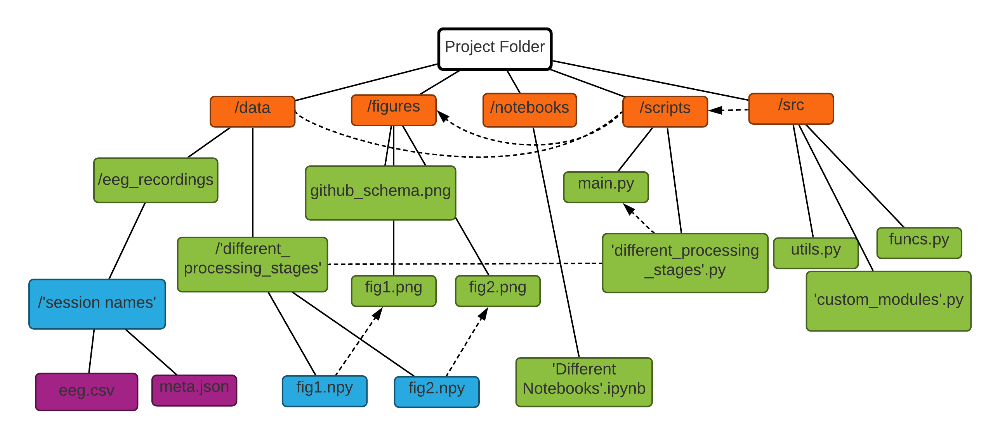

# Song Identification Project
[TritonNeuroTech @ UCSD](https://neurotechx.ucsd.edu/): Intro Project 

## Resources Used
[1] [Accurate Decoding of Imagined and Heard Melodies](https://www.frontiersin.org/articles/10.3389/fnins.2021.673401/full)  
[2] [The Multivariate Temporal Response Function (mTRF) Toolbox](https://www.researchgate.net/publication/311153152_The_Multivariate_Temporal_Response_Function_mTRF_Toolbox_A_MATLAB_Toolbox_for_Relating_Neural_Signals_to_Continuous_Stimuli)  
[3] [Joint Decorrelation, a Versatile Tool for Multichannel Data Analysis](http://www.sciencedirect.com/science/article/pii/S1053811914004534)  
[4] [Imagined Musical Scale Relationships Decoded from Auditory Complex](https://direct.mit.edu/jocn/article/34/8/1326/110884/Imagined-Musical-Scale-Relationships-Decoded-from)  

## Github Directories

- [`/data`](https://github.com/NeuroTech-UCSD/song_identification/tree/main/data) - Where the recorded eeg data, intermediate variables, and analysis results for plotting the figures will be stored. 
	- [`/data/data`](https://github.com/NeuroTech-UCSD/song_identification/tree/main/data/data) - Contains `.mat` files which contain the EEG data from the Dryad dataset.
	- [`/data/example_data`](https://github.com/NeuroTech-UCSD/song_identification/tree/main/data/example_data) - Contains example data for when we collect our own data.
- [`/figures`](https://github.com/NeuroTech-UCSD/song_identification/tree/main/figures/) - Stores all of the figures generated by the scripts. 
- [`/notebooks`](https://github.com/NeuroTech-UCSD/song_identification/tree/main/notebooks/) - Jupyter notebooks illustrating the data processing for JDA. 
- [`/scripts`](https://github.com/NeuroTech-UCSD/song_identification/tree/main/scripts/) - MATLAB scrips for pre-processing the data and stimulus reconstruction.

## Git SubModules
- [`/music_imagery`](https://github.com/NeuroTech-UCSD/song_identification/tree/main/music_imagery@cc303ad/) - MATLAB scrips for pre-processing the data into usable format and implementing stimulus reconstruction.

## Acknowledgement

